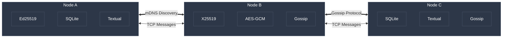

# TAD: Temporary Autonomous Devices

[](https://fabriziosalmi.github.io/tad/)
[](tests/)
[](https://www.python.org/)
[](LICENSE)

*Peer-to-peer decentralized chat for offline-first communities*

---

TAD is a **peer-to-peer, decentralized chat system** designed for offline-first communication in environments where traditional infrastructure fails or is absent:

- **Free Parties** - Coordinate without cell service
- **TAZ (Temporary Autonomous Zones)** - Community self-organization
- **Protests & Demonstrations** - Resilient communication
- **Remote Locations** - Chat on local networks

### Core Principles

1. **No Central Authority** - True P2P mesh networking
2. **Offline-First** - Works on local networks, no internet required
3. **Privacy by Design** - E2EE for private channels
4. **Resilience** - Gossip protocol ensures message delivery
5. **Simplicity** - Zero configuration, just works


---

## 📚 Documentation

**📖 [Complete Documentation](https://fabriziosalmi.github.io/tad/)** - Built with VitePress

Quick links:
- [Getting Started](https://fabriziosalmi.github.io/tad/guide/getting-started) - Install and run in 30 seconds
- [User Guide](https://fabriziosalmi.github.io/tad/guide/user-guide) - All commands and features
- [Deployment](https://fabriziosalmi.github.io/tad/guide/deployment) - systemd, Docker, Raspberry Pi
- [Architecture](https://fabriziosalmi.github.io/tad/reference/architecture) - Technical deep dive

Or browse local docs:
- [USER_GUIDE.md](USER_GUIDE.md) - Complete user manual
- [DEPLOYMENT.md](DEPLOYMENT.md) - Installation guide

---

## ⚡ Quick Install

```bash
# Automatic installation (recommended)
git clone https://github.com/fabriziosalmi/tad.git
cd tad
./install.sh

# Start TAD
./tad
```

### Manual installation

```bash
pip install -r requirements.txt
python -m tad.main
```

### Uninstall

```bash
./uninstall.sh
```

---

## 🚀 Quick Start

```bash
# Start TAD
./tad

# TUI commands:
/help                           # List all commands
/create #myChannel private      # Create encrypted channel
/invite <node_id> #myChannel    # Invite peer to channel
/export                         # Backup messages
/peers                          # Show connected peers
```

**Zero configuration needed!** Nodes auto-discover on the same network.


---

## 🏗️ Architecture

\`\`\`

\`\`\`

**Technologies:**
- **mDNS/Zeroconf** - Peer discovery
- **TCP/IP** - Direct connections
- **Gossip Protocol** - Message routing
- **Ed25519** - Message signing
- **X25519** - Key exchange
- **AES-256-GCM** - Message encryption
- **SQLite** - Message persistence
- **Textual** - Terminal UI framework

---

## Current Features
- mDNS peer discovery
- Direct TCP connections
- Gossip protocol routing
- Multi-channel chat
- Private encrypted channels
- Message persistence (SQLite)
- Advanced TUI interface
- Export/import functionality
- Message signing (Ed25519)
- 97 passing tests

---

## 🤝 Contributing

Contributions are welcome! See our [documentation](https://fabriziosalmi.github.io/tad/) for:

- [Testing Guide](https://fabriziosalmi.github.io/tad/reference/testing)
- [Architecture](https://fabriziosalmi.github.io/tad/reference/architecture)
- [API Reference](https://fabriziosalmi.github.io/tad/reference/api-node)

---

## 📄 License

This project is licensed under the **MIT License** - see the [LICENSE](LICENSE) file for details.

---

**Happy chatting! 🎉**

For support, open an issue on [GitHub](https://github.com/fabriziosalmi/tad/issues).
